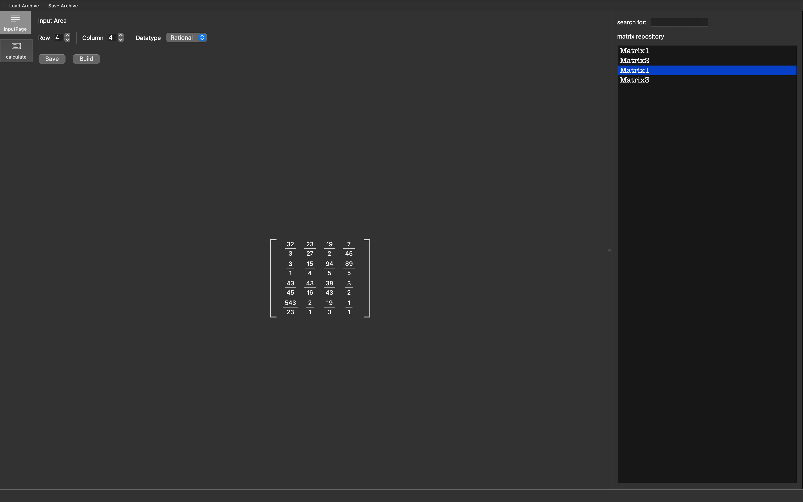
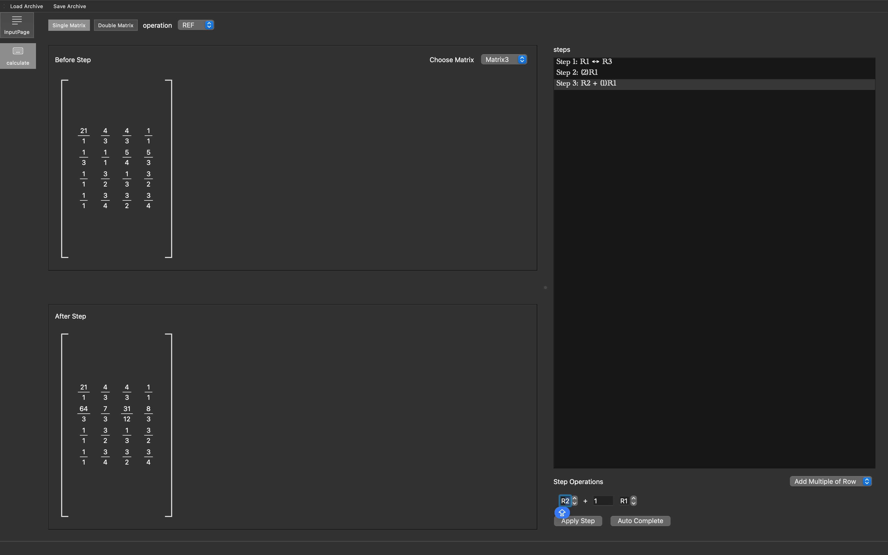

# Matrix Calculator

An interactive desktop matrix calculator focused on user-controlled, step-by-step row transformations rather than result-only computation.


> **Project status:** v0.1 alpha. The core workflows are usable, while testing, error handling, packaging, and cross-platform verification are still in progress.

## Table of Contents

- [Overview](#overview)
- [Why This Project](#why-this-project)
- [Key Features](#key-features)
- [Screenshots](#screenshots)
- [Core Workflows](#core-workflows)
- [Architecture](#architecture)
- [Build and Run](#build-and-run)
- [Testing](#testing)
- [Current Limitations](#current-limitations)
- [Roadmap](#roadmap)
- [License](#license)

## Overview

Matrix Calculator is a Qt desktop application for creating, reusing, and calculating with matrices containing integer, floating-point, or exact rational values.

Its primary workflow is interactive row transformation. Instead of requesting an operation and receiving only the final answer, the user chooses each elementary row operation, supplies the relevant rows and coefficients, and inspects the matrix before and after every step.

The application also includes a persistent, searchable matrix repository. A matrix can be entered once, assigned a name, saved, and reused in later calculations.

## Why This Project

### Make the calculation process controllable

Many matrix calculators are optimized for producing a final result. That is useful for verification, but it provides little control over the derivation and makes it difficult to understand how one matrix state leads to the next.

This project models a calculation as a sequence of user-directed transformations. Each step records the resulting matrix state and can be inspected through dedicated before-and-after views.

### Reduce repetitive matrix input

Entering a large or exact-valued matrix is time-consuming, especially when the same matrix is used in multiple calculations. The repository workflow reduces this repeated work through named records, search, persistent storage, and quick selection from the calculation page.

## Key Features

### Interactive row transformations

- Swap two rows.
- Scale a row by a user-provided factor.
- Replace one row using a linear combination of rows.
- Preserve intermediate matrix states in a step history.
- Inspect the matrix before and after the selected step.

### Matrix creation and computation

- Create and edit `Matrix<int>`, `Matrix<double>`, and `Matrix<Rational>` values.
- Preserve exact fractional values with a custom normalized `Rational` type.
- Perform same-type matrix addition, subtraction, and multiplication.
- Reuse the generic matrix engine independently of the UI layer.

### Reusable matrix interface

- Edit matrix cells through a custom Qt Model/View component.
- Switch between editable input and read-only result presentation.
- Render mathematical matrix brackets.
- Display rational values as vertically typeset fractions.
- Adapt cell and matrix dimensions to their contents.

### Repository and persistence

- Save matrices as named, UUID-based records.
- Search and select stored matrices from the interface.
- Serialize and deserialize the repository using versioned JSON.
- Keep JSON conversion, file access, and save-system coordination in separate components.
- Allow users to explicitly decide whether to load or save an archive.

## Screenshots

### Matrix Input and Repository



### Matrix Calculation and Row-Operation Steps



## Core Workflows

### Create and reuse a matrix

1. Select the row count, column count, and scalar type.
2. Build and edit the matrix through the input page.
3. Assign a name and save it to the in-memory repository.
4. Save the repository archive when persistence is required.
5. Search for and reuse the named matrix in a later calculation.

### Perform a manual row transformation

1. Select a source matrix from the repository.
2. Choose one of the supported elementary row operations.
3. Enter only the required row indices and scalar coefficients.
4. Apply the operation to produce the next matrix state.
5. Select a recorded step to compare its before-and-after states.

## Architecture

The application separates numerical logic, application state, persistence, and presentation so that the matrix engine is not coupled to Qt widgets.

| Area | Responsibility |
| --- | --- |
| `core/` | Generic `Matrix<T>` storage and operations, plus exact `Rational` arithmetic |
| `calculation/` | Row-operation and calculation-step data structures |
| `archive/` | Matrix records, repository state, JSON conversion, file access, and save/load coordination |
| `pages/` | Input and calculation workflows |
| `widgets/matrix/` | Reusable matrix widget, table model, and custom delegate |
| `mainwindow.*` | Top-level navigation and shared application coordination |

### Data flow

```text
User input
    -> Matrix<T>
    -> Matrix repository
    -> Calculation workflow
    -> Step history / result views

Matrix repository
    -> Versioned JSON serialization
    -> File storage
```

### Numerical model

The computation layer supports three scalar types while retaining their distinct behavior:

- `int` for integral matrices;
- `double` for floating-point matrices;
- `Rational` for normalized, exact fractional arithmetic.

A shared matrix representation carries these types between the repository, calculation pages, matrix widgets, and persistence layer without converting every value to floating point.

### Persistence model

Persistence is split into focused responsibilities:

- matrix records provide stable UUID identity and user-facing names;
- the repository owns the collection of records;
- JSON conversion validates and transforms repository data;
- file storage reads and writes raw bytes;
- the save system coordinates the complete archive workflow.

## Build and Run

### Requirements

- A C++17-compatible compiler
- Qt 6.5 or later with the `Core` and `Widgets` modules
- CMake 3.19 or later

### Build

```bash
git clone https://github.com/yueningli9529-sudo/matrix-calculator.git
cd matrix-calculator
cmake -S . -B build
cmake --build build
```

If CMake cannot locate Qt, provide the Qt installation prefix:

```bash
cmake -S . -B build -DCMAKE_PREFIX_PATH=/path/to/Qt/6.x.x/platform
cmake --build build
```

Run the generated `MatrixCalculator` executable from the build directory. On macOS, open the generated application bundle:

```bash
open build/MatrixCalculator.app
```

## Testing

The repository currently contains development tests for core numerical behavior, but they are not yet exposed as a repeatable CMake/CTest target. Establishing an automated test executable and integrating it into the standard build workflow are v0.1 stabilization tasks.

The planned automated suite will cover:

- `Rational` normalization, arithmetic, comparison, and invalid denominators;
- matrix construction, bounds, arithmetic, and dimension validation;
- elementary row operations;
- repository identity and duplicate handling;
- JSON round trips, malformed input, and schema-version rejection;
- save/load round trips and file failures.

## Current Limitations

- Binary operations require both matrices to use the same scalar type.
- Automatic REF and RREF workflows are not yet available in the desktop interface.
- Step deletion, downstream recalculation, and undo/redo are not yet implemented.
- Archive loading and saving are explicitly initiated by the user.
- Error reporting is not yet consistent across all workflows.
- Automated test coverage and clean-build verification are not yet part of CI.
- Release packages have not yet been produced or verified across supported platforms.

## Roadmap

### v0.1 — Stabilization and first release

- [x] Generic matrix and exact rational-number core
- [x] Editable and read-only matrix presentation
- [x] Named, searchable matrix repository
- [x] Same-type binary matrix operations
- [x] Manual elementary row transformations
- [x] Step history with before-and-after inspection
- [x] Versioned JSON save/load workflow
- [ ] Declare the required C++ standard explicitly in CMake
- [ ] Add a dedicated automated test target and CTest integration
- [ ] Standardize validation and user-facing error reporting
- [ ] Verify repository, calculation, and page-state transitions
- [ ] Test corrupted archives and file I/O failure paths
- [ ] Perform a clean build from a fresh checkout
- [ ] Select a license and publish the first tagged release

### Later releases

- [ ] Automatic REF and RREF workflows
- [ ] Step deletion with downstream recalculation
- [ ] Undo and redo for calculation steps
- [ ] Mixed-type operation policy and explicit result-type selection
- [ ] Richer formula visualization for binary operations
- [ ] Continuous integration for builds and tests
- [ ] Cross-platform packaging and release verification

## License

No open-source license has been selected yet. Until a license is added, the source code is publicly viewable but no permission to copy, modify, or redistribute it is granted.
